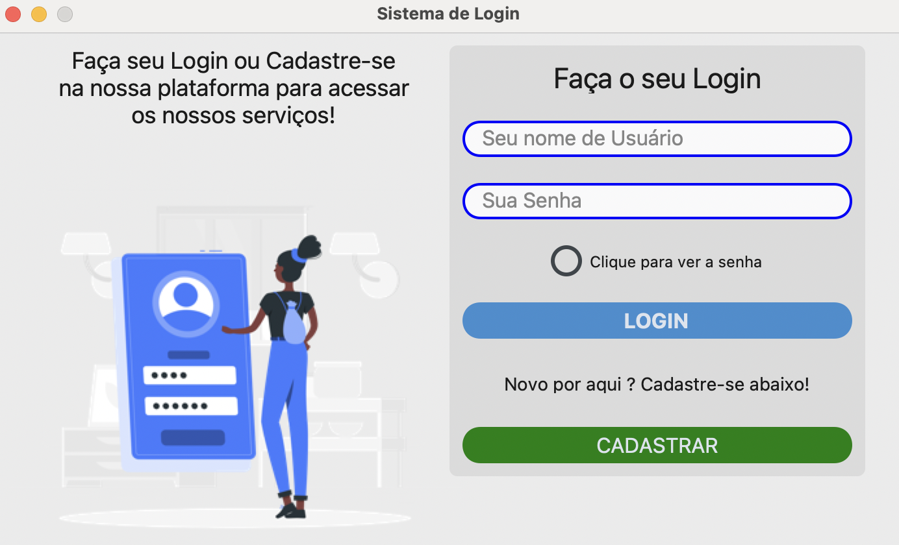
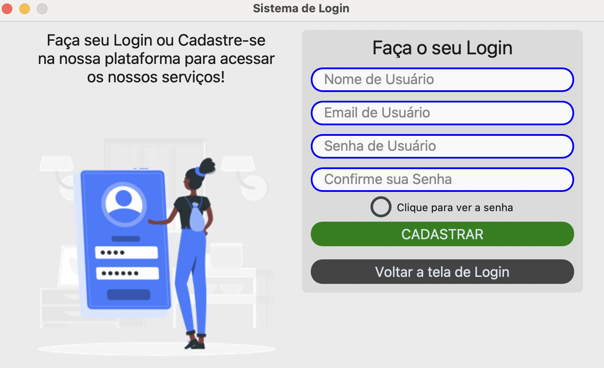

# SistemaLogin

Um pequeno sistema de cadastro e login de usuários com banco de dados SQL. Este projeto utiliza uma interface gráfica simples feita com **Tkinter** e **CustomTkinter**, permitindo a interação dos usuários com a aplicação.

> ⚠️ Este projeto é uma **adaptação** de um sistema já existente, com modificações feitas por Lucas Siqueira para fins de estudo e aprimoramento pessoal.




## Tecnologias Utilizadas

- Python
- SQLite3
- Tkinter
- PIL (Python Imaging Library)
- CustomTkinter

## Funcionalidades

- Cadastro de usuários com nome, email, senha e confirmação de senha.
- Login de usuários utilizando nome e senha.
- Armazenamento dos dados de usuários em um banco de dados SQLite.

## Como Rodar o Projeto

1. **Clone o repositório:**

    ```bash
    git clone https://github.com/usuario/nome-do-repositorio.git
    cd nome-do-repositorio
    ```

2. **Instale as dependências:**

    Certifique-se de que você tem o Python instalado, depois instale as bibliotecas necessárias:

    ```bash
    pip install -r requirements.txt
    ```

3. **Execute o programa:**

    O projeto roda em uma interface gráfica com Tkinter:

    ```bash
    python sistema_login.py
    ```

    Isso abrirá a janela do sistema de login e cadastro.

## Status do Projeto

Em desenvolvimento.

## Autor

Lucas Siqueira  
Adaptação de projeto original com modificações para fins educacionais.


